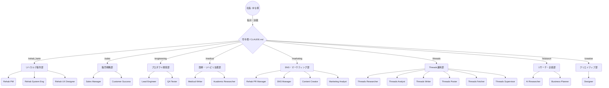

# 🏢 バーチャルAI会社 組織図および会社概要 (Company Overview)

## 1. 会社概要
当プロジェクト（`agens` フォルダ）は、理学療法士としての専門知識を最大限に活かし、システムの開発からマーケティング・情報発信・販売戦略までを一手に担う**完全自律型のバーチャルAIカンパニー**です。

- **代表取締役（人間）**: ゆな様（理学療法士・病院リハ部門責任者）
- **CEO（AI司令塔）**: `CLAUDE.md`
- **部門数**: 8部門
- **所属AIエージェント数**: 22名

## 2. 組織図 (Organization Chart)

## 3. 部門と所属エージェントの詳細

### 🏥 リハカルテ製作部（最重要プロジェクト）
- **`rehab_pm`**: カルテ要件定義・現場視点でのプロジェクト総責任者
- **`rehab_system_engineer`**: カルテ用バックエンド・セキュリティ技術者
- **`rehab_ux_designer`**: 忙しい臨床現場特化のUI/UXデザイナー

### 📈 販売戦略部（新規事業・サブスク展開）
- **`sales_manager`**: サブスクリプションモデルの策定、価格設定、販売チャネル開拓・営業戦略
- **`customer_success`**: 他院への導入支援、現場定着化のオンボーディング、解約防止・FAQ作成

### 🩺 医療・リハビリ支援部
- **`medical_writer`**: 院内マニュアルや患者指導箋などを論理的・倫理的に執筆
- **`academic_researcher`**: 最新エビデンス（文献・ガイドライン）の回収要約、学会骨子作成

### 💻 プロダクト開発部
- **`lead_engineer`**: リハカルテ以外のシステム・アプリ実装、要件定義
- **`qa_tester`**: コードレビュー・QA・バグテスト専門（生成・評価の分離）

### 🐦 Threads運用部（独立型・Threads専任）
- **`threads_researcher`**: ネタ・トレンド収集、投稿候補リスト生成
- **`threads_analyst`**: 過去データ分析、Writerへの指示書作成
- **`threads_writer`**: 採点付き投稿文生成（7.0未満は自動再生成）
- **`threads_poster`**: スケジュール管理・投稿実行
- **`threads_fetcher`**: 24h後メトリクス収集・履歴記録
- **`threads_supervisor`**: 異常監視・KILL_SWITCH管理・週次レポート

### 📱 SNS・マーケティング部
- **`rehab_pr_manager`**: リハカルテ開発過程の専属広報、プロセスエコノミーに基づく裏話の発信
- **`sns_manager`**: Threads/Twitter全体の運用・コミュニティマネジメント
- **`content_creator`**: ブログ・note記事の構成提案、執筆
- **`marketing_analyst`**: トレンド分析、ニーズ把握、テーマツリーの管理

### 🔍 リサーチ・企画部
- **`ai_researcher`**: 最新AIツールの動向調査・プロンプト開発
- **`business_planner`**: 全社的な事業計画立案（AI×リハビリのビジネスモデル等）

### 🎨 クリエイティブ部
- **`designer`**: 画像/動画生成AI向けのプロンプト作成、各種アイキャッチ作成、汎用UI指針

---

## 💡 【参考】複数部門への同時（並行）指示出しのやり方

本システムでは、以下の2つの方法で複数の部門を並行稼働させることができます。

**方法 A: 司令塔に「まとめて」任せる（直列・フェーズ分割）**
Claude Codeに対して以下のように指示を出します。
> 「/rehab_karte と /marketing のエージェントを呼んで。リハカルテの開発を進めながら、その『開発裏話』をテーマにしたSNS告知文を並行して作成して。」
※司令塔がフェーズを分解し、自動でエンジニア部とSNS部を順番に呼び出して処理してくれます。

**方法 B: ターミナルを複数開いて「並列」で動かす（同時処理）**
PCでターミナル（黒い画面）を2つ別々に立ち上げて、同時にClaude Codeを実行します。
- 画面①：「/rehab_karte サブスク向けの機能を開発して」
- 画面②：「/sales サブスクの月額費用と特典の戦略を立てて」
※これにより、お使いのパソコン上で全く別のエージェント（部門）を同時に作業させることが可能です。
